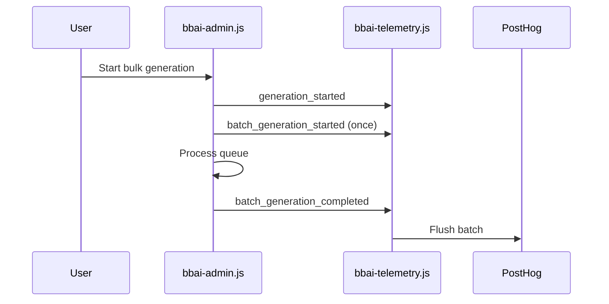
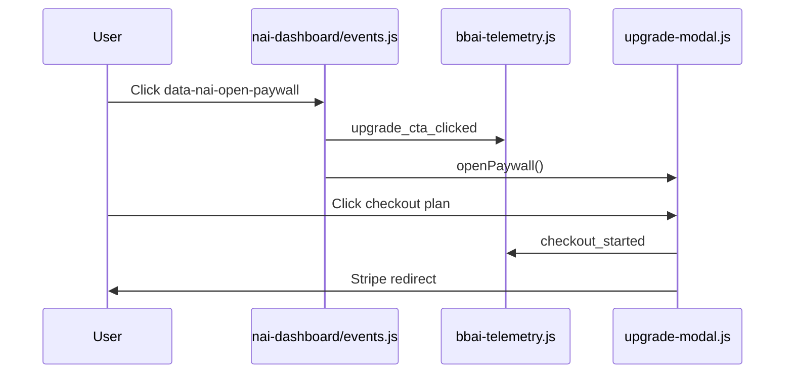

# Telemetry Final Hardening Audit

## Scope

This pass is limited to WordPress plugin telemetry hardening. It does not change
the live UI, dashboard layout, Stripe, authentication, business logic, PostHog
dashboard definitions, SQL/HogQL, SVN, or release packaging.

## Root Causes Fixed

- `plugin_activated` depended on lifecycle code that was not protected against
  reactivation duplicates. It now uses `bbai_telemetry_plugin_activated` and
  emits at most once for a persisted WordPress installation.
- `plugin_updated` only ran from the activation lifecycle. Active plugin updates
  do not call `register_activation_hook()`, so `admin_init` now compares the
  stored plugin version against the loaded plugin version and queues one update
  event per actual version change.
- Common property coverage had aliases missing from the central enricher. Server
  capture now adds `plugin_plan`, `wordpress_version`, and `environment` in
  addition to the existing site identity, host, version, plan, user state,
  session, and journey fields.
- Browser-originated telemetry config now includes the same aliases before the
  admin AJAX bridge forwards events to server-side capture.

## Site Identity

The canonical install identity is generated by `get_site_identifier()` in
`includes/helpers-site-id.php`, stored per site in multisite, and exposed as:

- `site_install_id`
- `site_id`
- `site_hash`
- `site_url`
- `site_host`
- `host`
- `journey_id`

Every plugin-owned event that reaches `BBAI_Telemetry::emit()` or
`BBAI_Telemetry::capture_posthog_event()` is enriched centrally with this identity
when WordPress site functions are available. Browser events also receive the same
identity through localized telemetry context and the admin server bridge.

## Feature Used

`feature_used` is guarded in both PHP and JavaScript. Allowed `feature_name`
values are:

- `dashboard`
- `library`
- `single_generation`
- `bulk_generation`
- `review`
- `settings`
- `statistics`
- `woocommerce`
- `billing`
- `account`

If a valid feature cannot be inferred, the event is dropped instead of sending
`unknown`, an empty value, or a non-canonical value.

Legacy `login` and `signup` feature aliases now map to `account`,
`review_queue` maps to `review`, and `quota` maps to `billing`.

## Canonical Event Audit

| Event | Exists | Required properties | Lifecycle / duplicate protection | Dashboard ready |
| --- | --- | --- | --- | --- |
| `wporg_downloads_daily` | External importer | Importer-owned | Importer-owned | Yes, already tracked |
| `wporg_stats_snapshot` | External importer | Importer-owned | Importer-owned | Yes, already tracked |
| `plugin_installed` | Not reliable in plugin | Not emitted by this hardening pass | WordPress.org install moment is not observable | Remove or grey out |
| `plugin_activated` | Yes | Central identity, version, plan, environment, WordPress/PHP versions | One-time marker per persisted installation | Yes |
| `plugin_updated` | Yes | `previous_version`, `previous_plugin_version`, current identity/version/host | Stored version comparison; one event per version change | Yes |
| `plugin_deactivated` | Yes | Central server properties when deactivation can run | WordPress deactivation hook | Yes |
| `plugin_opened` | Yes | Browser context plus server enrichment | Once per browser session | Yes |
| `dashboard_viewed` | Yes | Browser context plus server enrichment | Page view once per session/page key | Yes |
| `alt_library_viewed` | Yes | Browser context plus server enrichment | Page view path | Yes |
| `analytics_viewed` | Yes | Browser context plus server enrichment | Page view path | Yes |
| `usage_viewed` | Yes | Browser context plus server enrichment | Page view path | Yes |
| `settings_viewed` | Yes | Browser context plus server enrichment | Page view path | Yes |
| `first_run_completed` | Yes | Central properties | First-generation/user marker path | Yes |
| `generation_started` | Yes | Central properties plus `generation_mode` | JS run-id dedupe | Yes |
| `generation_completed` | Yes | Central properties plus generation metadata | JS run-id dedupe and PHP normalization | Yes |
| `alt_generated` | Yes | Central properties plus server generation metadata | Server-side generation path | Yes |
| `trial_generation_started` | Yes | Central properties | Trial UI path | Yes |
| `trial_generation_completed` | Yes | Central properties | Trial UI path | Yes |
| `image_regenerated` | Legacy alias path | Normalized/enriched centrally | Server generation path | Yes |
| `manual_alt_edit` | Yes | Central properties | Edit-change guard | Yes |
| `review_queue_opened` | Yes | Central properties | UI click path | Yes |
| `review_completed` | Yes | Central properties | Entitlement/review path | Yes |
| `generation_failed_timeout` | Yes | Error code, provider, retry, central properties | Failure normalization | Yes |
| `generation_failed_api` | Yes | Error code, provider, retry, central properties | Failure normalization | Yes |
| `generation_failed_auth` | Yes | Error code, provider, retry, central properties | Failure normalization | Yes |
| `generation_failed_no_credits` | Yes | Error code, provider, retry, central properties | Failure normalization | Yes |
| `generation_failed_invalid_image` | Yes | Error code, provider, retry, central properties | Failure normalization | Yes |
| `generation_failed_rate_limit` | Yes | Error code, provider, retry, central properties | Failure normalization | Yes |
| `generation_failed_network` | Yes | Error code, provider, retry, central properties | Failure normalization | Yes |
| `generation_failed_unknown` | Yes | Error code, provider, retry, central properties | Failure normalization fallback | Yes |
| `generation_blocked_no_credits` | Yes | Central properties | Entitlement dedupe key | Yes |
| `batch_generation_quota_limit_hit` | Yes | Central properties | Batch generation path | Yes |
| `batch_generation_partial_quota_stop` | Yes | Central properties | Batch generation path | Yes |
| `batch_generation_started` | Yes | Central properties plus `generation_run_id` | Once per batch run-id | Yes |
| `upgrade_cta_clicked` | Yes | Attribution plus central properties | Client dedupe | Yes |
| `checkout_started` | Yes | Attribution plus central properties | Client dedupe | Yes |
| `checkout_completed` | Alias only from confirmed completion signal | Central properties when emitted | Requires real confirmed purchase | Zero is expected without purchase |
| `signup_cta_clicked` | Yes | Central properties | UI path | Yes |
| `signup_started` | Yes | Central properties | Auth modal path | Yes |
| `signup_succeeded` | Yes | Central properties | `account_created` alias normalization | Yes |
| `login_cta_clicked` | Yes | Central properties | UI path | Yes |
| `login_modal_opened` | Yes | Central properties | Auth modal path | Yes |
| `login_submitted` | Yes | Central properties | Auth modal path | Yes |
| `login_succeeded` | Yes | Central properties | Auth modal path | Yes |
| `login_failed` | Yes | Central properties | Auth modal path | Yes |
| `trial_started` | Yes | Central properties | Trial path | Yes |
| `trial_expired` | Yes | Central properties | Trial path | Yes |
| `subscription_started` | Not authoritative in plugin | Backend/webhook-owned | Requires SaaS or Stripe confirmation | Do not expect from plugin |
| `subscription_cancelled` | Not authoritative in plugin | Backend/webhook-owned | Requires SaaS or Stripe confirmation | Do not expect from plugin |
| `credits_purchased` | Not authoritative in plugin | Backend/webhook-owned | Requires SaaS or Stripe confirmation | Do not expect from plugin |
| `feature_used` | Yes | Valid `feature_name`, context, central properties | Invalid feature names dropped | Yes |
| `support_clicked` | Yes | Central properties | UI path | Yes |
| `documentation_opened` | Yes | Central properties | UI path | Yes |

## Legitimate Property Limitations

- Server-side lifecycle events can include `session_id` only if a browser cookie
  already exists. Activation/update events usually occur before an admin browser
  session has initialized the telemetry cookie, so `session_id` may be absent.
- WordPress.org download/import events are outside the plugin runtime and are
  governed by the importer payload, not the WordPress plugin telemetry layer.
- Billing completion, subscription, and credit-purchase events are only reliable
  after backend or Stripe confirmation. The WordPress plugin should not fake
  those events from checkout intent.

## Plugin Installed

The WordPress plugin cannot reliably observe the WordPress.org installation
moment. `register_activation_hook()` proves activation, not installation, and it
also fires after manual uploads, local installs, and reactivations. This pass does
not add fake install events. The dashboard should remove `plugin_installed` as a
success metric or show it as a non-instrumentable limitation, with
`wporg_downloads_daily -> plugin_activated -> plugin_opened` used for the
reliable acquisition lifecycle.

## PostHog Dashboard Polish (2026-07-07)

### New Current Health cards

| Insight ID | Name |
| --- | --- |
| 9898415 | Current Health — Validation (24h / v4.6.110+) |
| 9898421 | Current Health — Required Properties (24h / v4.6.110+) |

Filter: `timestamp >= now() - INTERVAL 24 HOUR` OR semver `plugin_version >= 4.6.110`.

### Updated insights

| Insight ID | Change |
| --- | --- |
| 9888113 | Added `No activity` state for quiet lifecycle/checkout events |
| 9888162 | Simplified HogQL; `No activity` for quiet events; removed duplicate provider column |
| 9888152 | Semver sort (latest first); deduped `previous_versions`; `No activity` state |
| 9778749 | Documented `No activity` state in telemetry key |

### Removed duplicate dashboard tile

- Removed tile 9112459 (`Plugin Version Adoption — Active Sites`, insight 9788160) from dashboard 1791626. Kept insight 9888152 as the canonical version adoption card.

## Expected Dashboard Coverage

After this pass, plugin-owned telemetry should report near-100% coverage for
events that the WordPress plugin can truthfully observe. Remaining zeros are
expected for real-purchase and backend-owned lifecycle events when no confirmed
purchase/subscription activity occurred in the selected time range.

## 4.6.114 Verification Release

### Root causes fixed

| Failure (4.6.113 E2E) | Root cause | Fix |
| --- | --- | --- |
| `$entitlement_state` undefined | NAI shell block referenced `$entitlement_state` before dashboard enqueue initialized it | Initialize entitlement snapshot at start of `enqueue_dashboard_assets()` |
| `WP_Scripts::localize` warning on library | `wp_localize_script()` called for handles not registered/enqueued (`bbai-contact-modal`, `bbai-upgrade`, optional `bbai-debug`) | `localize_script_if_enqueued()` guard |
| `batch_generation_started` missing | Client emitted legacy `bulk_generation_started` only | Canonical `batch_generation_started` in `bbai-admin.js`, NAI drawer path, allowlist + run-id dedupe |
| `upgrade_cta_clicked` missing on library | NAI `[data-nai-open-paywall]` intercepted click before upgrade-modal listener | Emit `upgrade_cta_clicked` in `nai-dashboard/events.js` before opening paywall |
| `checkout_started` not confirmed | Fallback Stripe redirect path skipped telemetry | Fire + flush in `openCheckoutUrl()` immediately before `window.open()` |
| Auth funnel events lost on redirect | Page reload before AJAX telemetry flush | `bbaiTelemetry.flush()` after `login_succeeded` / `signup_succeeded` |

### Verified event matrix (4.6.114)

| Event | Trigger location | Dedupe |
| --- | --- | --- |
| `plugin_opened` | `bbai-telemetry.js` `sendPageView()` | Session storage + `bbaiTrackOnce` |
| `dashboard_viewed` / `alt_library_viewed` | `bbai-telemetry.js` `sendPageView()` | `bbaiTrackOnce` per page variant |
| `batch_generation_started` | `bbai-admin.js` `startInlineGeneration()`, `nai-dashboard/generation.js` bulk drawer | `generation_run_id` seen-set |
| `batch_generation_completed` | `bbai-admin.js` bulk finalize | Existing batch payload |
| `upgrade_cta_clicked` | Locked CTAs, upgrade modal, NAI paywall, telemetry fallback listeners | 800ms + attribution key |
| `checkout_started` | Upgrade modal click, `openCheckoutUrl()` pre-redirect | Session seen-set + 800ms upgrade dedupe |
| `signup_started` | `auth-modal.js` `handleRegister()` before fetch | 800ms double-submit guard |
| `signup_succeeded` | `auth-modal.js` on AJAX success | Session seen-set + flush |
| `login_succeeded` | `auth-modal.js` on AJAX success | Session seen-set + flush |

### Sequence diagrams

### Verification checklist

- [ ] Library page loads without PHP notices for `$entitlement_state`
- [ ] Library page loads without `WP_Scripts::localize` warnings
- [ ] Bulk generation emits exactly one `batch_generation_started` before `batch_generation_completed`
- [ ] Library NAI paywall CTA emits `upgrade_cta_clicked`
- [ ] Checkout button emits `checkout_started` only when redirect opens (not on AJAX failure)
- [ ] Signup/login success events appear in PostHog before page reload
- [ ] Filter PostHog health cards to `plugin_version >= 4.6.114`
